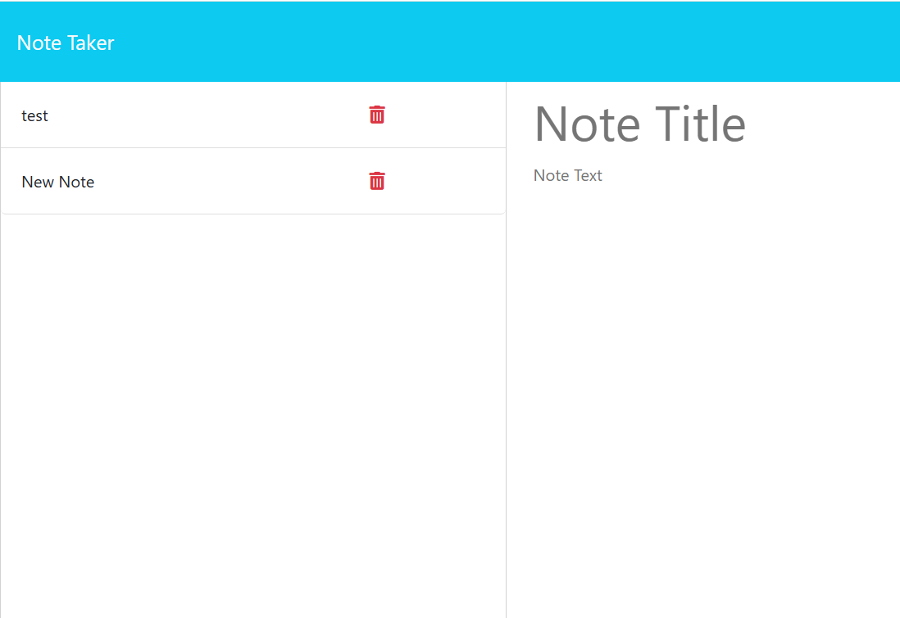

# Express.js Note Taker Application

## Description

This project required me to build the back-end functionality for a fully designed front-end note-taking application. The application allows users to create, view, and delete notes, improving productivity and organization.

In this project:

- I used server-side logic using Node.js and the Express.js framework to handle routing, file management, and API functionality. 

- I deployed the application using Render, gaining hands-on experience with modern deployment workflows.

- I used RESTful API routes to handle GET, POST, and DELETE requests for note management.

This project helped me gain a deeper understanding of server-side development, deployment processes, and creating scalable, user-friendly applications.

## Table of Contents

- [Installation](#installation)
- [Usage](#usage)
- [Credits](#credits)
- [License](#license)

## Installation

Use "npm i" to download the Express library.

## Usage

To use this application just click on get started and you should be prompted to enter a new note.  Once you enter a note title and description, press the save note button and see your note appear on the side with other previous notes. 

<a href="">Link To Deployed Site</a> 

## Credits

<a href="https://www.npmjs.com/package/express">Express Library</a>

<a href="https://www.npmjs.com/package/uuid">UUID Library</a>

<a href="https://gist.github.com/lukas-h/2a5d00690736b4c3a7ba">License Page</a> 

## License

